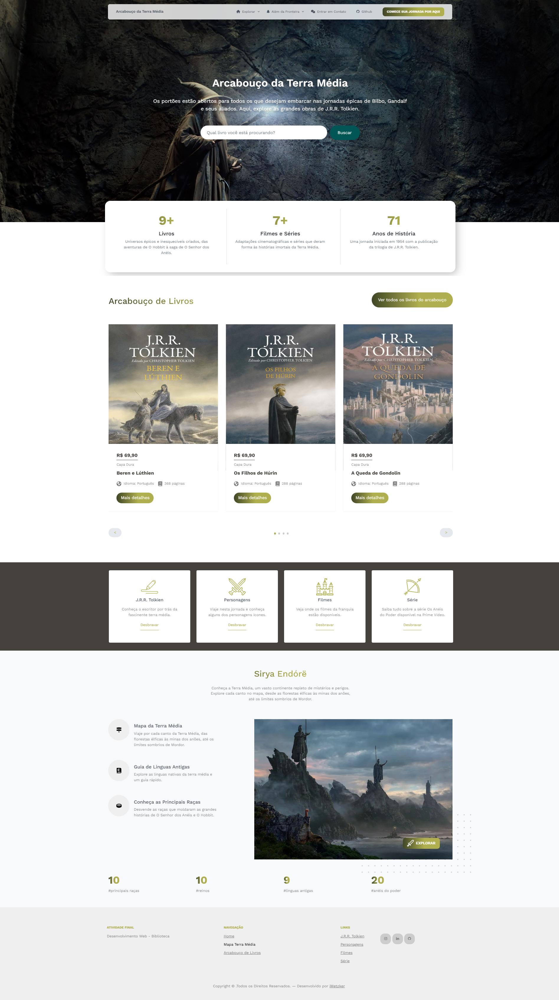
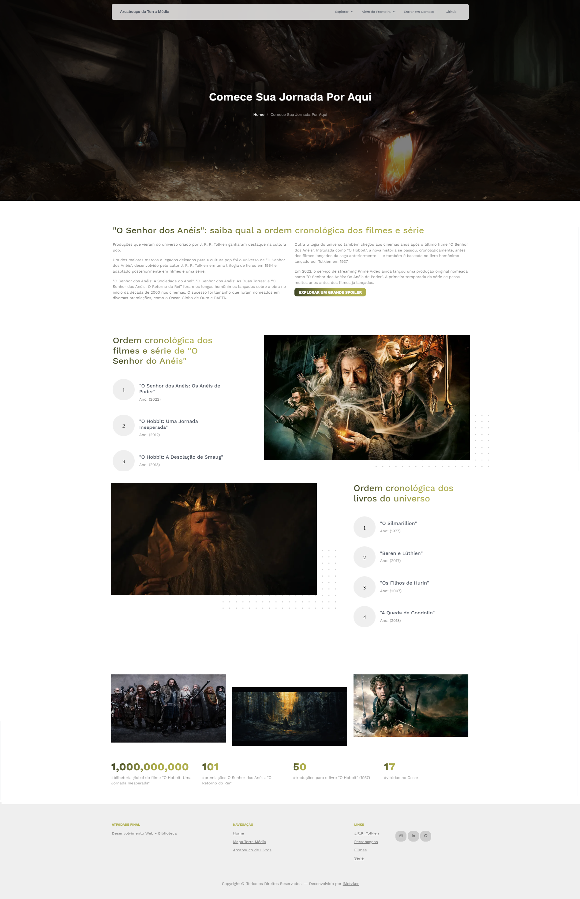
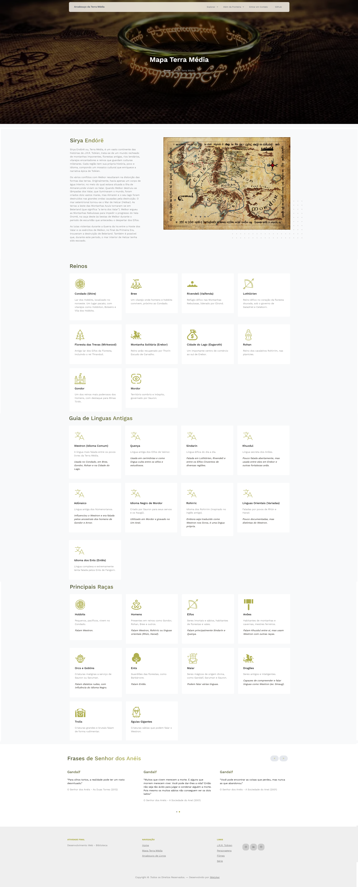
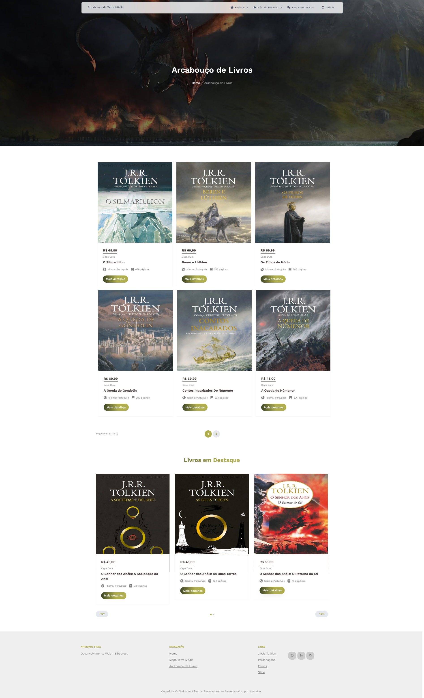
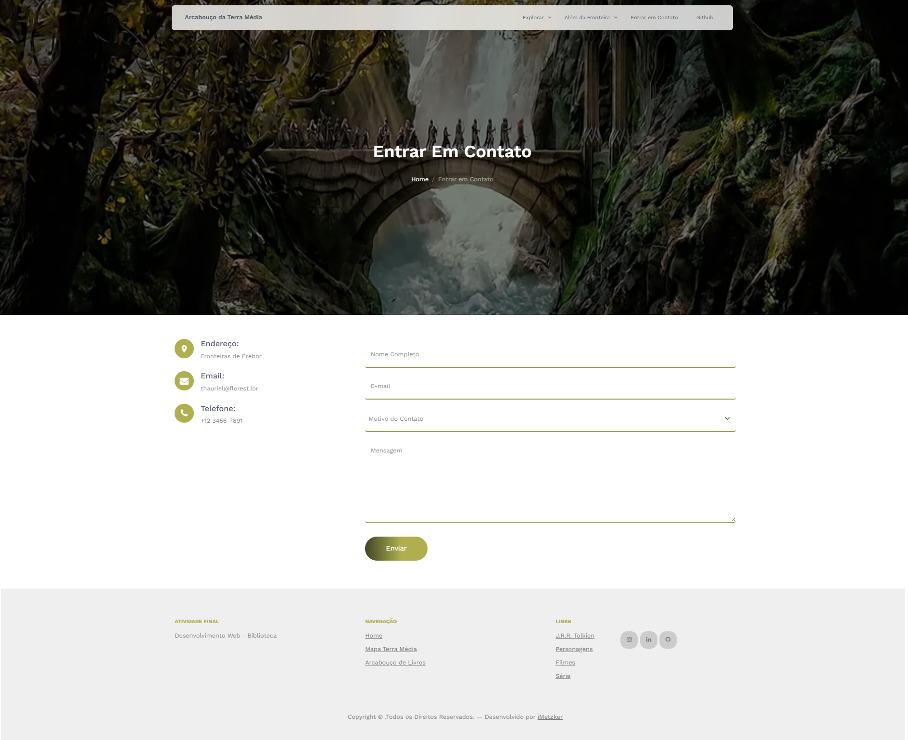

# Desenvolvimento Web 1

 

## 🚀 Atividade Final
Repositório temporário destinado a atividades avaliativas da disciplina de Desenvolvimento Web I.

> Curso: Sistemas de Informação  
> Período: 3º  
> Docente: Maria Lauara

## 📎 Desafio

## Projeto
Para este projeto, escolhi um tema pelo qual sou profundamente apaixonada: o universo criado por J.R.R. Tolkien - O Hobbit ❤️.
 
Desenvolvi um site dedicado às suas obras mais icônicas O Senhor dos Anéis e O Hobbit.
 
Além da biblioteca com os livros, incluí funcionalidades extras que enriquecem a experiência, como uma tela introdutória intitulada "Comece por Aqui", ideal para quem está começando a embarcar na trilogia (ou para curiosos), e um mapa da Terra Média, com curiosidades e informações sobre esse mundo.

> Páginas:
> - Home
> - Guia Início da Jornada
> - Arcabouço de Livros
> - Mapa da Terra Média
> - Contato

## 🛸 Tecnologias Utilizadas

- HTML 5
- CSS 3
- Bootstrap 5
- JavaScript
- Tiny Slider

## 🖥️ Demonstração

### ✨Home

### Comece sua Jornada Por Aqui (Guia do Iniciante)

### Mapa da Terra Média

### Arcabouço de Livros

### Contato

